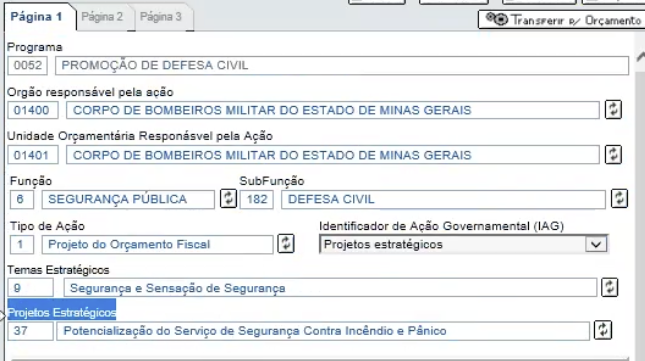
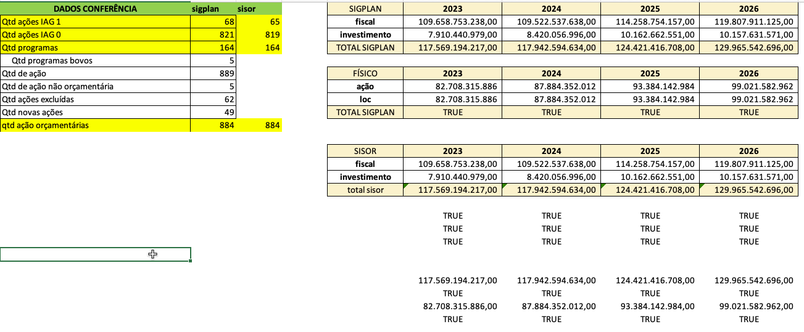

## Remover linhas com exclusão lógica

>  IMPORTANTE: retirar da seleção das bases as ações, programas, localizadores e indicadores excluídos à tanto nas bases quanto nas tabelas dinâmicas;

Filtrar somente linhas com `is_deleted_* == TRUE`

## Garantir equivalência entre bases do SISOR e SIGPLAN 

- Fiscal vs investimento
- Orçamentárias vs não orçamentárias

## Verificar em TODAS as colunas de TODAS as bases se os campos que começam com “-“ (hífen) trouxeram todos os dados do sistema. 

>  Verificar em TODAS as colunas de TODAS as bases se os campos que começam com “-“ (hífen) trouxeram todos os dados do sistema. 

Identificar todas as células que possuem caracter especial (eg. -, *, ., |, #). A identificação se é um erro ou não acontece via verificação no SIGPLAN.

Checar se a conversão para o excel gera problemas.

## Verificar se cada programa possui apenas uma área temática. É obrigatório a existência de uma área por programa;

>  Verificar se cada programa possui apenas uma área temática. É obrigatório a existência de uma área por programa;

Esse item deve ser capaz de lidar com a desformatação do layout no volume final que aconteceu por causa da base localizadores sem área tematica em uma ação identificada pela DCPPN no final da quinta feira.

## Verificar se cada programa possui pelo menos algum ODS;

>  Verificar se cada programa possui pelo menos algum ODS;

1 ou mais ODS por programa. 

Programas padronizados (705) podem selecionar a opção de "não tem ODS"

Não pode haver célula vazia.

## Verificar se existem programas com ODS 18 - Não Possui Objetivo de Desenvolvimento Sustentável, conjugado com outro (s) ODS (s) (neste caso, verificar com o órgão qual deveria ser o correto);

>  Verificar se existem programas com ODS 18 - Não Possui Objetivo de Desenvolvimento Sustentável, conjugado com outro (s) ODS (s) (neste caso, verificar com o órgão qual deveria ser o correto);

## Quantos programas existem? ______ (deverá ser a mesma quantidade das bases ação e localizadores);

>  Quantos programas existem? ______ (deverá ser a mesma quantidade das bases ação e localizadores);

Incluir bases do sisor que possuem universo de progrmas (eg. qdd fiscal e base item despesa) e base programas na conferência

## Os programas excluídos e incluídos devem ser os mesmos nas bases programas, ações e localizadores assim como a quantidade destes;

>  Os programas excluídos devem ser os mesmos nas bases programas, ações e localizadores assim como a quantidade destes;

Como zerou a base (ie. não é ano de revisão) esse check não faz sentido

## Os programas incluídos (novos) devem ser os mesmos nas bases programas e ação.

>  Os programas incluídos (novos) devem ser os mesmos nas bases programas e ação.

## Verificar se as ações estratégicas possuem algum projeto estratégico;

>  Verificar se as ações estratégicas possuem algum projeto estratégico;

Se a ação tiver IAG 1 obrigatoriamente deve estar preenchido o nome do projeto estratégico associado. Vide exemplo:



## Verificar se cada programa possui apenas uma área temática. É obrigatório a existência de uma área por programa;

>  Verificar se cada programa possui apenas uma área temática. É obrigatório a existência de uma área por programa;

duplicado

## Verificar se os setores de governo estão corretos;

>  Verificar se os setores de governo estão corretos;

Será necessário receber tabela de apoio com os setores corretos para conferência do valor existente na base ação e localizadores (checar se existe).

Definir fluxo para recebimento da tabela de apoio.

Essa informação é usada nos volumes mas é proveniente do próprio sistema transacional.

## Quantos programas existem? ______ (deverá ser a mesma quantidade da base programas e localizadores); 

>  Quantos programas existem? ______ (deverá ser a mesma quantidade da base programas e localizadores);

(duplicado)

## Quantas ações existem? _____ (deverá ser a mesma quantidade da base localizadores);

>  Quantas ações existem? _____ (deverá ser a mesma quantidade da base localizadores);

Incluir bases do sisor que possuem universo das ações na conferência

- Qtd ações IAG 1
- Qtd ações IAG 0

## Verificar se os totais dos valores orçamentários e físicos de cada ano do PPAG estão iguais aos da base localizadores;

>  Verificar se os totais dos valores orçamentários e físicos de cada ano do PPAG estão iguais aos da base localizadores;

Fazer a conferência do total por ação (e não pelo valor global)

Incluir sisor (todos os anos e bases) na conferência dos valores orçamentários.

Incluir a base programa na conferência  (necessário eliminar os programas repetidos que são gerados por diretrizes/outros duplicados)

## Verificar quantos são e quais são os programas excluídos e incluídos;

>  Verificar quantos são e quais são os programas excluídos e incluídos;

duplicado

## As ações excluídas e incluídas devem ser os mesmos nas bases ações e localizadores assim como a quantidade destes;

>  Verificar quantos são e quais são as ações excluídas e incluídas.

## Conferir os valores físicos e orçamentários (de todos os anos) das ações com a soma dos localizadores para cada ação. 

>  Conferir os valores físicos e orçamentários (de todos os anos) das ações com a soma dos localizadores para cada ação. 

Esse item está relacionado ao "Verificar se os totais dos valores orçamentários e físicos de cada ano do PPAG estão iguais aos da base localizadores"

## Conferir se quando o indicador tiver o índice de referência “em apuração”, também existe a justificativa;

>  Conferir se quando o indicador tiver o índice de referência “em apuração”, também existe a justificativa;

Avaliar se faz sentido gerar notificações com base no número de caracteres ou tipos de caracteres (eg. .)

## Conferir se quando o indicador tiver alguma previsão “em apuração”, também existe a justificativa;

>  Conferir se quando o indicador tiver alguma previsão “em apuração”, também existe a justificativa;

Avaliar se faz sentido gerar notificações com base no número de caracteres ou tipos de caracteres (eg. .)

## Verificar se algum índice de referência está com data futura;

>  Verificar se algum índice de referência está com data futura;

Acima de 30/09 do ano corrente não é data válida

## Verificar se quando o indicador permanece na revisão, ele continua sem índice de referência e/ou sem previsão das metas (isso ocorre quando estas estão marcadas – “em apuração”). O ideal é que esse indicador tenha índice de referência;

> Verificar se quando o indicador permanece na revisão, ele continua sem índice de referência e/ou sem previsão das metas (isso ocorre quando estas estão marcadas – “em apuração”). O ideal é que esse indicador tenha índice de referência;

Somente faz sentido em ano de revisão e é necessário incorporar base dos indicadores de monitoramento para conferência.

## Verificar se índices de referência com valor “zero” estão corretos;

>  Verificar se índices de referência com valor “zero” estão corretos;

Utilizar base de homologação para determinar como os valores ausentes estão presentes na base.

```R
# ok porque apesar de NA ele está em apuração
indicadores_planejamento[is.na(indice_de_referencia), .(programa_cod, programa_nome, indicador, indice_de_referencia, em_apuracao_indice_de_referencia)] |> View()
```

## Verificar se indicadores com ausência de meta em algum ano estão corretos – atentar principalmente para o último ano da revisão;

>  Verificar se indicadores com ausência de meta em algum ano estão corretos – atentar principalmente para o último ano da revisão;

A meta está nsa colunas `previsao_para_ano_*`

Não pode haver NA a menos que ele esteja em apuração (eg. caso de um indicador novo)

## Verificar se existe algum indicador em que as metas e índice de referência estão em apuração

Gerar notificação para avaliação se o indicador deve ser mantido no PPAG.

## Verificar se as metas previstas como “zero” estão corretas;

>  Verificar se as metas previstas como “zero” estão corretas;

Relacionado com item "Verificar se índices de referência com valor “zero” estão corretos" para encaminhamentos

## Observar se indicadores sem metas em anos específicos é devido à periodicidade do indicador. Ex: indicador bianual só terá previsão de meta a cada dois anos;

>  Observar se indicadores sem metas em anos específicos é devido à periodicidade do indicador. Ex: indicador bianual só terá previsão de meta a cada dois anos;

Relacionado com item "Verificar se existe algum indicador em que as metas e índice de referência estão em apuração"


## Verificar porque existem indicadores sem índice, mas com metas previstas;

>  Verificar porque existem indicadores sem índice, mas com metas previstas;

Em apuração ou 0 podem ser checados.

Receber exemplos da base de homologação

## Verificar porque existem indicadores com índice, mas sem metas previstas;

>  Verificar porque existem indicadores com índice, mas sem metas previstas;

## Após conferir as bases do PPAG (Sigplan) é necessário verificar se estas estão compatíveis com as bases do Orçamento (Sisor);

>  Após conferir as bases do PPAG (Sigplan) é necessário verificar se estas estão compatíveis com as bases do Orçamento (Sisor);

duplicado mas pode ser interessante um relatório de resumo com os valores totais



## Verificar se o valor total do orçamento (orçamento fiscal e orçamento de investimento das empresas controladas) coincide com a projeção do PPAG para o ano seguinte;

>  Verificar se o valor total do orçamento (orçamento fiscal e orçamento de investimento das empresas controladas) coincide com a projeção do PPAG para o ano seguinte;

duplicado mas pode ser interessante um relatório de resumo com os valores totais

## Verificar se o valor total do orçamento plurianual (orçamento fiscal e orçamento de investimento das empresas controladas) coincide com a projeção do PPAG para os demais três anos;

>  Verificar se o valor total do orçamento plurianual (orçamento fiscal e orçamento de investimento das empresas controladas) coincide com a projeção do PPAG para os demais três anos;

## Conferir se o valor do orçamento de investimento é o mesmo nas bases do Sisor e Sigplan;

>  Conferir se o valor do orçamento de investimento é o mesmo nas bases do Sisor e Sigplan;

Pode ser que esteja incluído nas conferências anteriores mas pode fazer sentido uma seleção por UO (iniciadas com 5)

## Conferir se o valor do orçamento fiscal é o mesmo nas bases Sisor e Sigplan assim como da base Item fiscal;

>  Conferir se o valor do orçamento fiscal é o mesmo nas bases Sisor e Sigplan assim como da base Item fiscal;

duplicado

## Verificar se a quantidade de ações orçamentárias do PPAG é a mesma nas bases do orçamento fiscal e do orçamento de investimento. Para tanto, é importante lembrar de excluir as ações não orçamentárias nas bases do Sigplan. 

>  Verificar se a quantidade de ações orçamentárias do PPAG é a mesma nas bases do orçamento fiscal e do orçamento de investimento. Para tanto, é importante lembrar de excluir as ações não orçamentárias nas bases do Sigplan. 

duplicado
